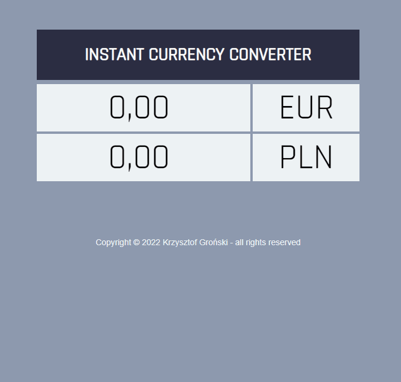

# **CURRENCY CONVERTER**

## Description
This application allows you to convert available currencies according to any selected currency pair. The values are converted instantly on data entry.

## Contents
- User friendly interface
- 4 currencies supported: EUR/USD/GBP/PLN

## Technologies
- HTML
- CSS
- JS ES6+
- BEM

## Features
- Visual styling
- Instant rate calculation

> Currency exchange rates update: ***November 02, 2022***

## Demo
https://krzysztof-gronski.github.io/currency-converter/

## Preview

